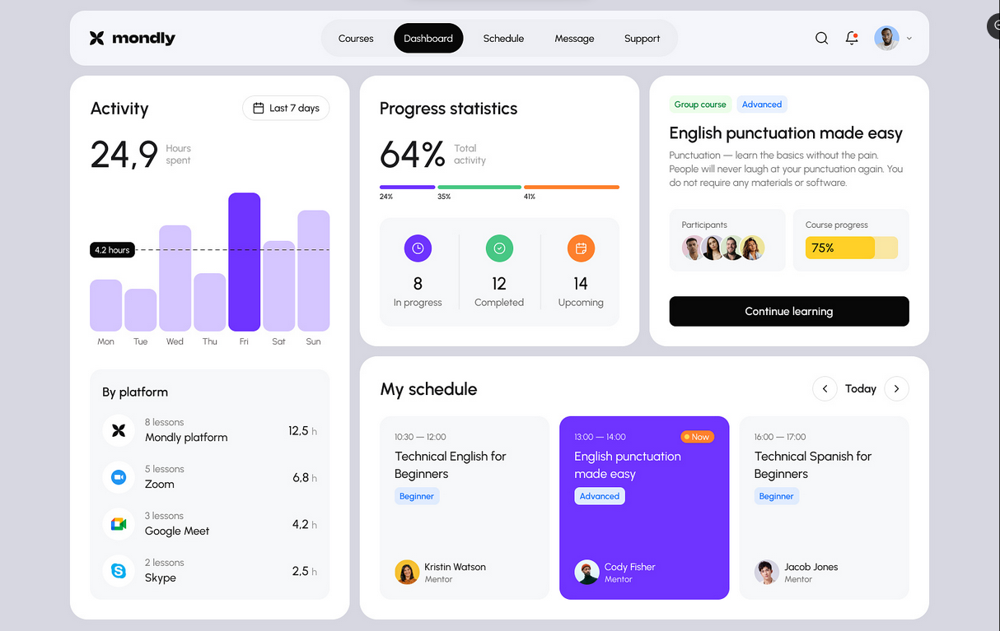

# TASK 1

The task is to replicate the design below:

### Design link

- [Dribble](https://dribbble.com/shots/23949154-Mondly-UX-UI-Dashboard-Design-for-Language-Learning-Platform)

### Instructions for the task

- Replicate the design  **layout and appearance** as possibly as you can.
- The task is not expected to be **responsive**.

### Stack used

- Html
- Css
